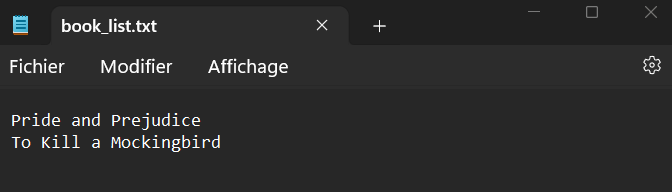
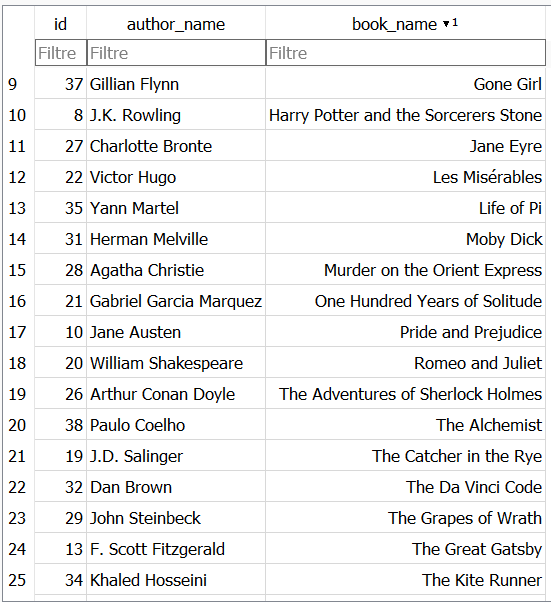
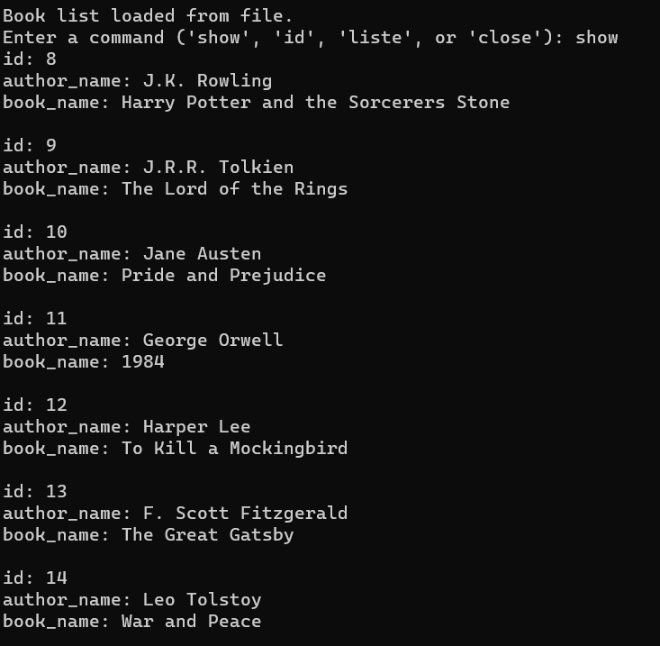
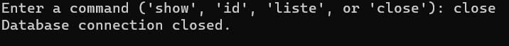

# Synopsis:

This C project utilizes SQLite3 to enable users to create a personalized list of their favorite books, selecting from a collection of the most renowned books in history.

# Details:

The program automatically saves the list of favorite books, allowing easy access during subsequent program sessions.

The list of favorite books is stored in a file named "book_list.txt," which is created alongside the program.

The SQLite database is stored in a file named "listedeslivres.db," located next to the program.

# Commands:

show: This command displays a comprehensive list of the most famous books in history. Each book is identified by an ID, and includes a title and the name of the author.

id: This command enables users to select a book from the list and add it to their list of favorite books.

liste: This command shows the names of the books in the favorite list.

close: This command terminates the program.

