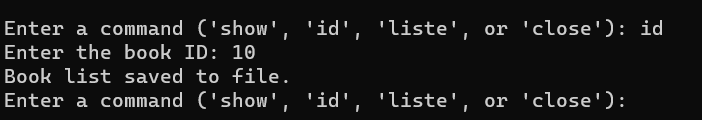
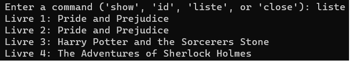

# Synopsis:

This  <b>C</b> project utilizes  <b>SQLite3</b> to enable users to create a personalized list of their favorite books, selecting from a collection of the most renowned books in history.

# Details:

The program automatically saves the list of favorite books, allowing easy access during subsequent program sessions.

The list of favorite books is stored in a file named <b>"book_list.txt"</b> which is created alongside the program.

The SQLite database is stored in a file named <b>"listedeslivres.db"</b> located next to the program.

# Commands:

## Show
This command displays a comprehensive list of the most famous books in history. Each book is identified by an ID, and includes a title and the name of the author.

## Id
This command enables users to select a book from the list and add it to their list of favorite books.

## Liste
This command shows the names of the books in the favorite list.

## Close
This command terminates the program.

